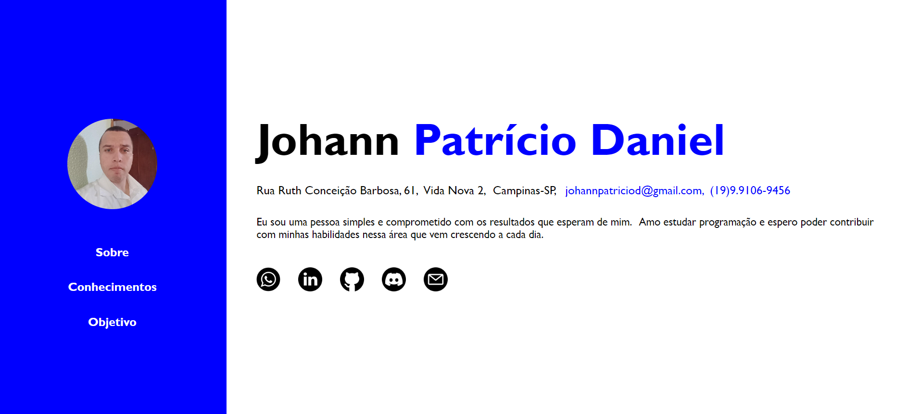
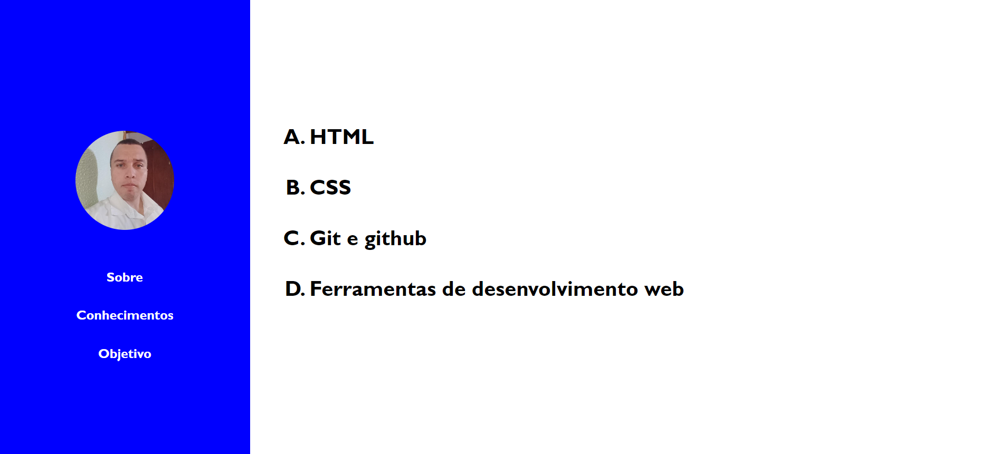
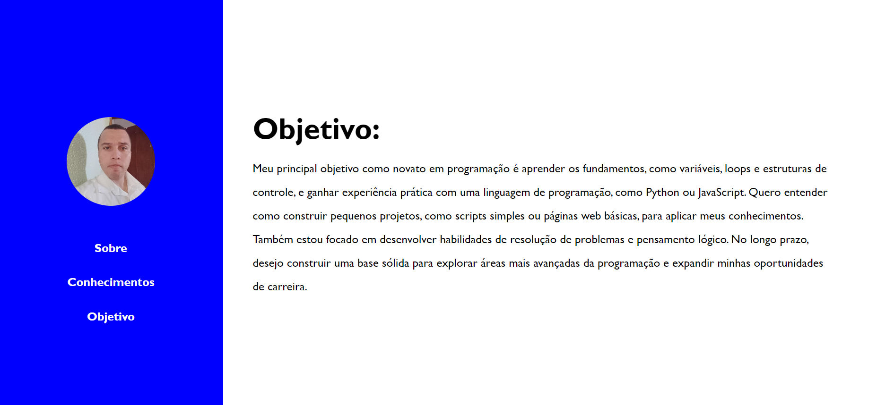
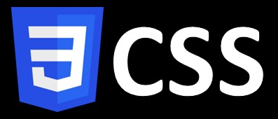

# Atividade_Final_FrontEnd1

Este projeto é um site pessoal que serve como um portifólio para Johann Patrício Daniel. Ele foi projetado para apresentar informações-chave sobre Johann, incluindo uma introdução pessoal, suas habilidades técnicas, objetivos profissionais e métodos de contato.

A estrutura do site é composta por três páginas principais:

<h3>Sobre (Home):</h3>  

Esta página oferece uma visão geral de Johann, destacando seu compromisso com a programação e sua paixão pelo aprendizado. Inclui informações de contato, como endereço, e-mail e número de telefone com links diretos para plataformas como WhatsApp, LinkedIn, GitHub, Discord e e-mail.

<h3>Conhecimentos:</h3> 

Aqui, os visitantes podem encontrar uma lista das habilidades e conhecimentos técnicos de Johann, incluindo HTML, CSS, Git/GitHub e ferramentas de desenvolvimento web. A organização por lista facilita a leitura e a compreensão dos conhecimentos do Johann.

<h3>Objetivo:</h3> 

Esta página detalha as aspirações de Johann em relação à programação e suas metas de aprendizado, incluindo os fundamentos da programação, desenvolvimento de pequenos projetos e a busca por oportunidades de carreira no futuro.

O design do site é clean e intuitivo, com uma interface simples para facilitar a navegação. O layout é dividido em duas seções principais: uma barra lateral que contém a navegação e uma área principal para o conteúdo de cada página. O uso de ícones para redes sociais e outras plataformas ajuda a conectar os visitantes diretamente aos perfis de Johann nessas redes.

Em resumo, este site é uma ferramenta eficaz para Johann apresentar sua identidade profissional e manter uma presença online que pode ser compartilhada com potenciais empregadores, colegas e contatos da indústria. Com as informações bem organizadas e o design simplificado, é uma forma eficaz de destacar suas habilidades, experiências e objetivos.

## Técnologias usadas:

    
    
    
    
    

